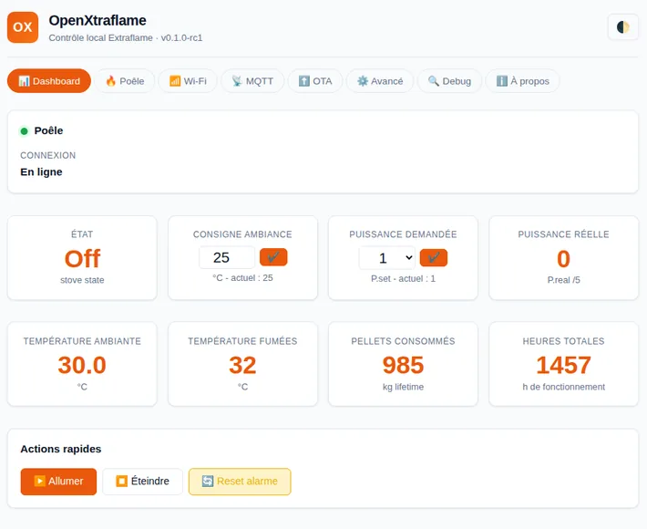
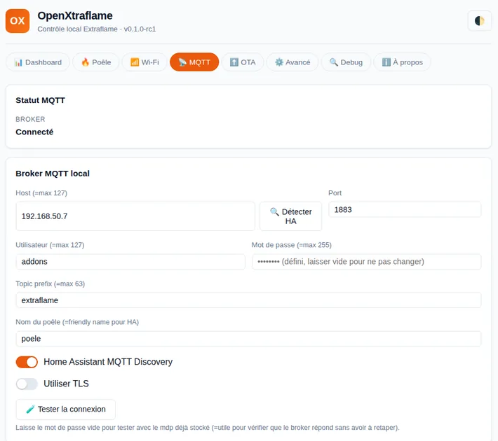
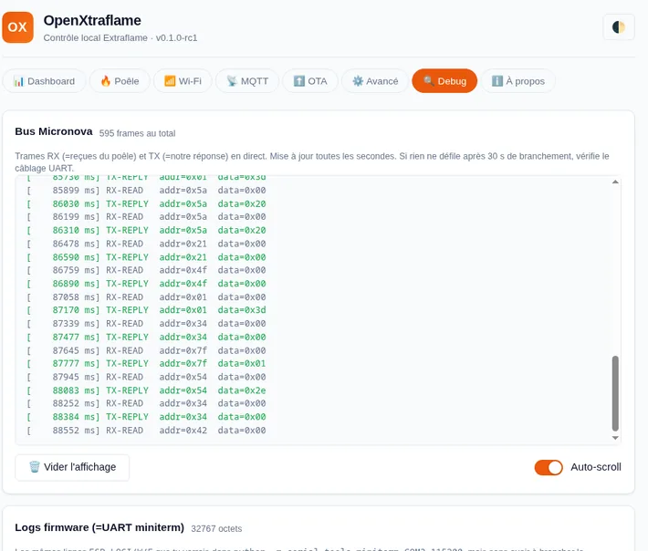
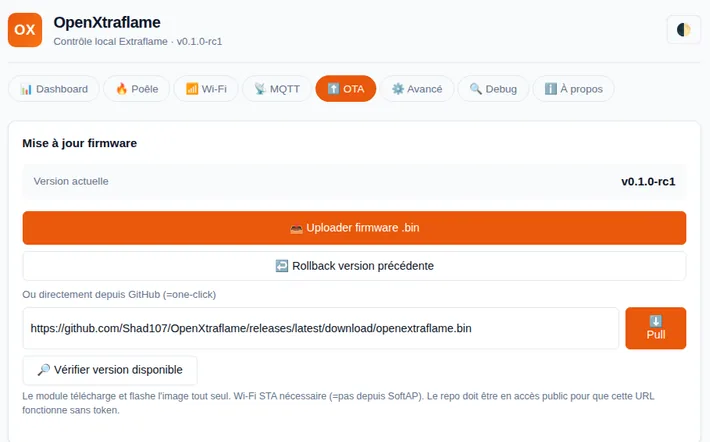
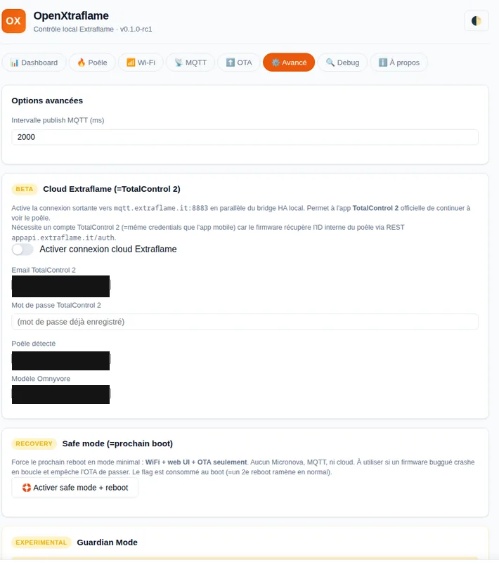
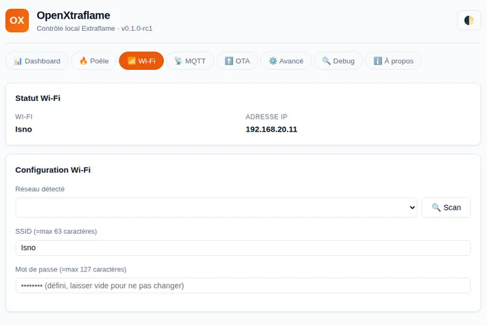
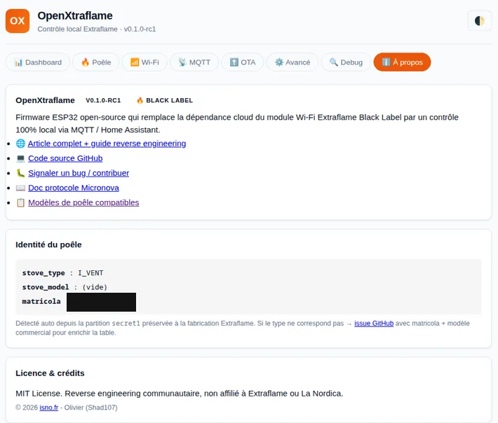

# OpenXtraflame

[](https://github.com/Shad107/OpenXtraflame/releases)
[](LICENSE)
[](https://github.com/Shad107/OpenXtraflame)
[](https://github.com/Shad107/OpenXtraflame/issues)
[](https://github.com/espressif/esp-idf)
[](https://home-assistant.io)

Custom firmware open-source pour les poêles à granulés Extraflame (et compatibles Micronova).

**Statut** : v0.1.0-rc2 (=release candidate, usage perso validé sur Extraflame Teodora Evo)

## Objectif

Remplacer la dépendance cloud Omnyvore (`mqtt.extraflame.it:8883`) par un contrôle 100% local via MQTT vers Home Assistant / Mosquitto.

**Bonus** : mode cloud compatible avec l'app TotalControl 2 officielle (=BETA, TARGET_BLACKLABEL uniquement).

## Deux targets

### Target A : "External" (=recommandé, safe)

Firmware pour un ESP32 spare connecté en parallèle au bus série du poêle. Le module Extraflame Black Label reste INTACT.

- Matériel : ESP32-WROOM-32 spare + fils dupont
- Câblage : bus série poêle (=connecteur TA côté main board)
- Approche similaire à philibertc/micronova_controller
- Cloud non disponible (=nécessite matricola + secure_code du module d'origine)

### Target B : "Black Label Replacement" (=avancé)

Firmware qui REMPLACE celui d'origine sur le module Extraflame Black Label. Nécessite dump du firmware original en backup.

- Matériel : module Black Label 289€ Extraflame
- Réutilise pinout SERIAL 4-pin natif
- Restauration possible via dump firmware original
- Cloud MQTT compatible TotalControl 2 (=BETA)

## Architecture

```
┌─────────────────┐         ┌─────────────────┐         ┌─────────────────┐
│                 │  UART   │                 │  Wi-Fi  │                 │
│  Poêle          │38400 8N1│  ESP32 avec     │  MQTT   │ Home Assistant  │
│  Extraflame     ├─────────┤  OpenXtraflame ├─────────┤ + Mosquitto     │
│  Teodora Evo    │Micronova│  firmware       │  local  │ (=local only)   │
│                 │  proto  │                 │         │                 │
└─────────────────┘         └─────────────────┘   │     └─────────────────┘
                                                  │
                                                  │ MQTTS (=optionnel, BL only)
                                                  │
                                                  ▼
                                          ┌──────────────┐
                                          │  Omnyvore    │  ← app TotalControl 2
                                          │  cloud       │
                                          └──────────────┘
```

## Nouveautés v0.1.0-rc2

**Onglet Maintenance complet** (=UI + MQTT HA Discovery) :
- Auto-diagnostic combustion data-driven (=règles simples sur t_fumées, ratio puissances, alarmes)
- Compteurs service (=heures + heures avant service) et nettoyage brasero (=démarrages) avec boutons reset
- Table **Pr01-Pr30 lecture + écriture** en direct sur EEPROM Micronova (=mapping validé Micronova I023 aria)
- Édition Pr avec zones de safety (`SAFE` / `COMBUSTION` / `DANGER`) + double confirmation
- Historique alarmes (=ring buffer 20 entrées NVS avec timestamps + durées + labels FR)
- Rollback firmware 1-clic (=bouton UI + button HA + cmd MQTT `rollback_firmware`)

**Registres reverse-engineered** (=Teodora Evo I_VENT via Addrs_dyn) :
- `SERBATORIO_VUOTO` (=trémie vide) exposé binary_sensor HA
- `MODULATION` (=% modulation actuelle) exposé sensor HA
- `CAUSA_STATO7` (=raison arrêt) exposé attribut
- Prédiction date recharge trémie (=EMA 7 jours, sensor timestamp HA)

**MQTT Discovery étendu** :
- `sensor.<stove>_params_tech` (=state = nb Pr divergents factory, attrs = table complète)
- `sensor.<stove>_combustion_diag` (=severity + liste diagnostics)
- `sensor.<stove>_history_alarms` (=count + events avec durées)
- `sensor.<stove>_pellets_kg_per_day` / `pellets_days_left` / `pellets_empty_ts`
- `sensor.<stove>_hours_since/before_service` / `starts_since/before_cleaning`
- `binary_sensor.<stove>_tremie_vide` (=alerte pellets épuisés, device_class problem)
- `button.<stove>_reset_service` / `reset_cleaning` / `rollback_firmware`

**Performance** :
- Hot polling registres critiques (=latence poêle→HA 9s → 1s validée en prod)

**Fix majeur** :
- Watcher passif zone tech désactivé après brick 2026-07-09 (=cause saturation UART + NVS write flood, refonte throttle en cours pour v0.1.0)

**Companion à venir** : service Docker `openxtraflame-brain` (=roadmap v0.2) pour learning historique long-terme + propositions actionnables 1-clic. Voir [docs/BRAIN.md](docs/BRAIN.md).

Voir [docs/MAINTENANCE.md](docs/MAINTENANCE.md) pour la documentation détaillée de l'onglet Maintenance.

## Fonctionnalités (v0.1.0-rc1)

**Local (=les 2 targets)** :
- ✅ Wi-Fi provisioning via SoftAP + web UI Vue-like
- ✅ MQTT bridge vers HA (=state + commandes)
- ✅ HA Discovery : température, puissance, consigne, chrono, alarmes, compteurs
- ✅ Compteurs pellets (=kg total, coût lifetime, autonomie)
- ✅ 4 profils chrono éditables (=heures + jours + température + puissance)
- ✅ Auto-détection stove_type via Addrs_dyn (=I_VENT, I_CANAL, I_CALD, I_IDRO)
- ✅ OTA over-the-air via web UI + endpoint /ota/pull URL
- ✅ Sensors HA : uptime, dernier démarrage
- ✅ Safe mode (=bouton web UI ou 3 crashes auto → reboot minimal WiFi+OTA seulement)

**Cloud (=Black Label uniquement)** :
- ✅ Auth handshake reverse (=matricola + secure_code, MQTT 3.1.1)
- ✅ Cert CA Omnyvore embedded (=extrait du dump firmware original)
- ✅ Format topic complet : `omv/ex/{MAC}/{model} 1.8/{matricola}/{DIR}/{family}`
- ✅ Login REST `appapi.extraflame.it/auth` auto (=fetch stove_id + model)
- ✅ Publish OUT : temperature, status, settings, workingtimers
- ✅ Subscribe IN : settings (=cmd cloud → EEPROM Micronova)
- ✅ Reply MQTT avec correlationid pour ack
- ✅ Switch HA cloud on/off (=conditionnel si login TC2 configuré)

## Aperçu de l'interface

Interface web locale servie directement par le module, sans aucun cloud.

<p align="center">
  
</p>

<table>
  <tr>
    <td></td>
    <td></td>
  </tr>
  <tr>
    <td></td>
    <td></td>
  </tr>
  <tr>
    <td></td>
    <td></td>
  </tr>
</table>

## Latence

- Poêle physique → snapshot firmware : ~1s pour registres critiques (=hot polling actif), ~15s pour cold registres (=table complète 100+ registres)
- Snapshot → HA (=MQTT publish local) : 2s (=publish_interval_ms)
- Snapshot → cloud Omnyvore : 30s (=cycle publish cloud)

## Reverse engineering

Le firmware original du module Extraflame Black Label a été dumpé et analysé pour reconstruire :

- Protocole Micronova UART (=1200 baud 8N2, ligne inversée, opcode read/write EEPROM)
- Format frame `[loc][addr][val][cks]` avec checksum additif
- 60 tables Addrs_dyn (=une par variant modèle)
- Format topic MQTT cloud + auth handshake
- Cert TLS CA Omnyvore

Voir :
- [docs/PROTOCOLE-MICRONOVA.md](docs/PROTOCOLE-MICRONOVA.md) - bus série + registres
- [docs/CLOUD_REVERSE_NOTES.md](docs/CLOUD_REVERSE_NOTES.md) - cloud MQTT + REST API
- [docs/STOVE-TYPES.md](docs/STOVE-TYPES.md) - 60 modèles supportés
- [analysis/firmware-cartography.md](analysis/firmware-cartography.md) - dump analysis

## Build

```bash
# ESP-IDF v5.2.7 requis (via docker recommandé)
cd firmware
docker run --rm -v $PWD:/project -w /project espressif/idf:v5.2.7 idf.py build

# Ou build cible external :
docker run --rm -v $PWD:/project -w /project espressif/idf:v5.2.7 \
  bash -c "idf.py -DOPENXFLAME_TARGET=external build"
```

Voir [docs/BUILDING.md](docs/BUILDING.md).

## Structure du projet

```
OpenXtraflame/
├── README.md                    # ce fichier
├── LICENSE                       # MIT
├── firmware/
│   ├── CMakeLists.txt           # racine, PROJECT_VER + target detect
│   ├── sdkconfig.defaults
│   ├── partitions.csv           # layout compatible dump original
│   └── main/
│       ├── main.c               # orchestration tasks + safe boot detector
│       ├── config_nvs.c/h       # config NVS + safe_mode flag
│       ├── wifi_bridge.c/h      # STA + SoftAP + scan JSON
│       ├── mqtt_bridge.c/h      # publish state + discovery HA + cmd handler
│       ├── cloud_bridge.c/h     # MQTT cloud Extraflame (=blacklabel only)
│       ├── cloud_rest.c/h       # REST API appapi.extraflame.it (=fetch stove info)
│       ├── micronova.c/h        # protocole série poêle + shadow RAM + write queue
│       ├── web_ui.c/h           # HTTP config server + OTA endpoint + safe_mode
│       ├── log_ring.c/h         # 32KB ring buffer pour /debug/logs
│       ├── ota.c/h              # OTA subsystem + rollback safety
│       ├── leds.c/h             # status indicators
│       ├── web/                 # index.html + style.css + script.js embedded
│       └── certs/
│           └── extraflame_ca.pem # CA Omnyvore (=extrait du dump firmware)
├── docs/
│   ├── STATUS.md
│   ├── BUILDING.md
│   ├── DUMPING_ORIGINAL.md      # procédure dump 8h
│   ├── HARDWARE_TARGET_EXTERNAL.md
│   ├── HARDWARE_TARGET_BLACKLABEL.md
│   ├── MQTT_PROTOCOL.md         # topics HA local
│   ├── CLOUD_REVERSE_NOTES.md   # reverse cloud Omnyvore/Extraflame
│   ├── PROTOCOLE-MICRONOVA.md   # bus série + registres RAM/EEPROM
│   ├── STOVE-TYPES.md           # 60 modèles supportés Addrs_dyn
│   ├── OTA.md                   # procédure mise à jour
│   ├── RELATED_PROJECTS.md
│   └── IDEAS.md                 # backlog features
├── analysis/                    # reverse engineering notes brutes
├── ha-config/                   # exemples HA yaml
└── tools/                       # scripts helpers (=make_esp32_elf, ghidra, qemu)
```

## Roadmap

- [x] Dump firmware original Extraflame Black Label
- [x] Analyse partitions + protocoles
- [x] Cartographie complète firmware
- [x] Setup ESP-IDF v5.2.3 + toolchain docker
- [x] Skeleton code + build
- [x] Wi-Fi manager + SoftAP config
- [x] MQTT client vers Mosquitto local
- [x] UART Micronova protocole (=1200 8N2, ligne inversée)
- [x] Web UI configuration + OTA
- [x] Test sur Black Label (=Target B, avec backup)
- [x] Integration HA MQTT Discovery
- [x] Cloud Extraflame Omnyvore compatible (=BETA, TotalControl 2 fonctionne)
- [x] Safe mode + boot loop detector
- [x] Hot polling registres critiques (=<1s latence poêle→HA)
- [x] Recovery via rollback OTA slot précédent (=partition factory dédiée reportée v0.2)
- [x] Documentation www.isno.fr (=article publié)
- [x] Onglet Maintenance UI (=diag + Pr01-Pr30 R/W + historique alarmes)
- [x] Prédiction date recharge trémie (=EMA 7j)
- [ ] Test sur ESP32 spare (=Target A) - à valider avec un ESP32 externe
- [ ] Companion service `openxtraflame-brain` Docker (=learning + propositions actionnables)
- [ ] Watcher passif zone tech safe (=throttle 5-10s + bounded NVS)
- [ ] Recovery firmware en partition factory dédiée (=v0.2)

## Licence

MIT (=voir LICENSE)

## Disclaimer

Ce projet est un travail de reverse engineering effectué sur du matériel personnel dans un but éducatif et pour usage personnel. Aucun code binaire dérivé d'Extraflame n'est distribué. Les cert CA embedded proviennent du dump firmware personnel de l'auteur (=usage privé).

L'utilisation de ce firmware sur votre matériel est à vos risques et périls. Extraflame ne fournit pas de support pour cette utilisation.

**Le mode cloud compatible TotalControl 2** nécessite un compte Extraflame officiel avec le poêle enregistré, et utilise les credentials (=matricola + secure_code) présents sur l'étiquette du poêle. Aucun bypass ni détournement de licence n'est effectué.
